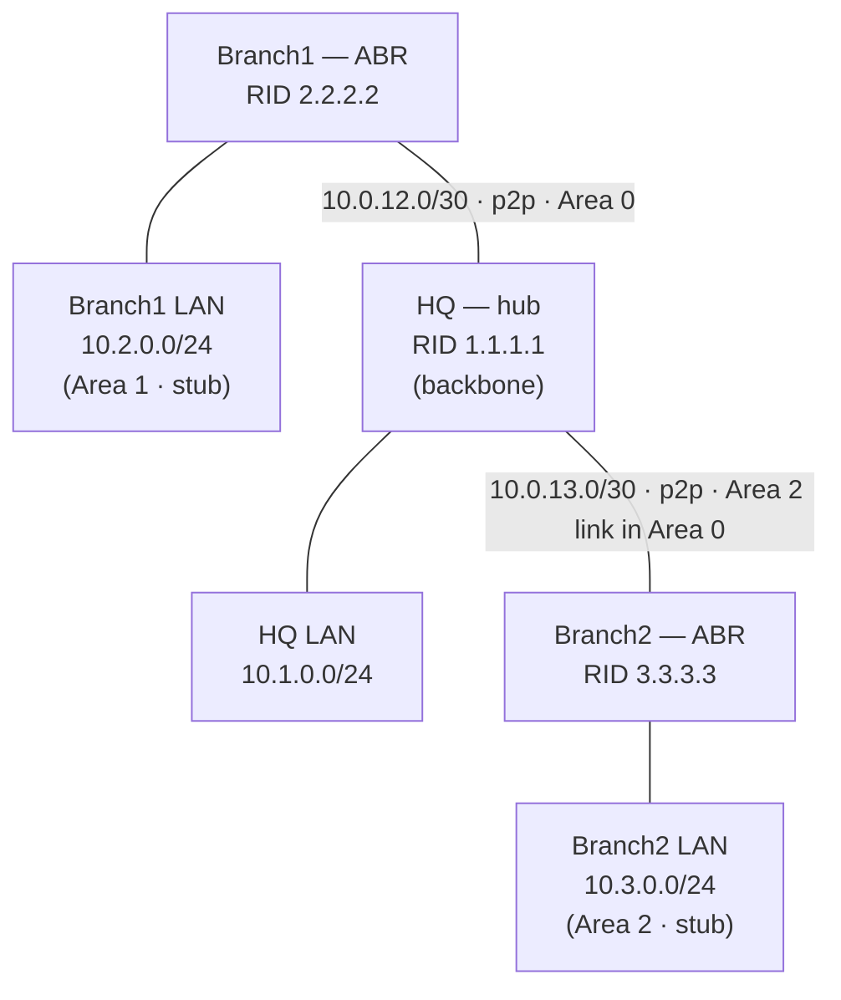

# Lab 01 — Multi-site OSPF + Site-to-Site IPsec VPN

Three sites (HQ + two branches) connected over a simulated WAN in a hub-and-spoke
topology, running **multi-area OSPF** (an area-0 backbone with two **stub areas**) and,
on top of it, a **site-to-site IPsec VPN** between HQ and Branch1.

- **Platform:** GNS3
- **Routers:** VyOS (rolling release) — VyOS runs FRRouting for OSPF and strongSwan for IPsec in one box
- **Status:** OSPF designed, built, and verified ✅ · IPsec VPN — *in progress*

---

## Objective

- Build a realistic multi-site enterprise WAN: a hub (HQ) and two branch sites.
- Run OSPF with a backbone (area 0) and per-branch **stub areas** so branch routers stay lean.
- Add a site-to-site **IPsec tunnel** so HQ↔Branch traffic is encrypted in transit (compliance use case).
- Verify with adjacencies, route tables, and end-to-end reachability.

## Topology



All WAN links are point-to-point `/30`s in **area 0**. Each branch router is an **ABR**:
area 0 on the WAN side, its own **stub area** on the LAN side.

## IP addressing

| Device | Interface | IP / mask | OSPF area | Role |
|--------|-----------|-----------|-----------|------|
| **HQ** | router-id | `1.1.1.1` | — | hub / backbone |
| | `eth0` → Branch1 | `10.0.12.1/30` | 0 | WAN link (p2p) |
| | `eth1` → Branch2 | `10.0.13.1/30` | 0 | WAN link (p2p) |
| | `dum0` (LAN) | `10.1.0.1/24` | 0 | HQ LAN (passive) |
| **Branch1** | router-id | `2.2.2.2` | — | ABR |
| | `eth0` → HQ | `10.0.12.2/30` | 0 | WAN link (p2p) |
| | `dum0` (LAN) | `10.2.0.1/24` | **1 (stub)** | Branch1 LAN (passive) |
| **Branch2** | router-id | `3.3.3.3` | — | ABR |
| | `eth0` → HQ | `10.0.13.2/30` | 0 | WAN link (p2p) |
| | `dum0` (LAN) | `10.3.0.1/24` | **2 (stub)** | Branch2 LAN (passive) |

> LANs are modeled with VyOS `dummy` interfaces (always up; advertise the full `/24`,
> unlike a true loopback which advertises a `/32`).

## Design decisions (the *why*)

- **Hub-and-spoke** — mirrors real branch WANs: branches connect to HQ, not to each other. Branch-to-branch traffic transits the hub.
- **Static router-IDs** (`1.1.1.1` / `2.2.2.2` / `3.3.3.3`) — deterministic and stable; they won't shift if an interface flaps.
- **Stub areas at the branches** — a branch is a leaf site. A stub area blocks **Type 5 (external) LSAs**; the ABR injects a single **default route** instead. Result: smaller routing tables, less CPU/RAM, and stability (a flap elsewhere doesn't churn the branch).
- **`passive-interface default`, then opt-in the WAN links** — every interface is passive by default; OSPF is explicitly enabled only on links facing another router. Fail-safe: you can't accidentally form an adjacency on a user-facing LAN. A passive interface still *advertises* its subnet but sends no hellos.
- **Point-to-point network type on `/30` links** — skips the pointless DR/BDR election on two-router links: no 40-second wait, faster convergence, cleaner database.

## Config

Sanitized VyOS exports for each router live in [`configs/`](configs/).
Key VyOS commands used:

```bash
# Identity + interface
set system host-name HQ
set interfaces ethernet eth0 address 10.0.12.1/30
set interfaces dummy dum0 address 10.1.0.1/24

# OSPF
set protocols ospf parameters router-id 1.1.1.1
set protocols ospf area 0 network 10.0.12.0/30
set protocols ospf passive-interface default              # default passive
set protocols ospf interface eth0 passive disable         # opt the WAN link back in
set protocols ospf interface eth0 network point-to-point  # no DR/BDR on a /30

# Branch ABR — declare the LAN area as a stub
set protocols ospf area 1 area-type stub
```

## Verification

Full captures are in [`verification/`](verification/). Highlights:

**Adjacency (clean point-to-point — note the `Full/-`, no DR/BDR):**
```
Neighbor ID  Pri State        Up Time   Address     Interface
1.1.1.1        1 Full/-       1m08s     10.0.12.1   eth0:10.0.12.2
```

**Branch1 routing table — learned every site dynamically (no static routes):**
```
O>* 10.1.0.0/24 [110/2] via 10.0.12.1, eth0     # HQ LAN
O   10.2.0.0/24 [110/1] is directly connected, dum0
O>* 10.3.0.0/24 [110/3] via 10.0.12.1, eth0     # Branch2 LAN, 2 areas + hub away
```

**End-to-end proof — Branch1 LAN → Branch2 LAN (crosses area 1 → area 0 → area 2):**
```
ping 10.3.0.1 source-address 10.2.0.1 count 4
4 packets transmitted, 4 received, 0% packet loss
```

## Lessons learned

- **Network-type mismatch — "adjacency Full but no routes."** With one end of a `/30`
  set to `broadcast` and the other to `point-to-point`, the OSPF neighbor reached
  **Full**, but **no transit routes installed** through it. Cause: the two ends describe
  the link differently in their LSAs, so SPF's **bidirectional check** fails and refuses
  to compute routes through that neighbor. The tell was **asymmetry** — HQ had one
  branch's LAN but not the other's — which pinpointed the single still-mismatched link.
  Fix: set both ends to `point-to-point`; it converged instantly.
  *Takeaway: Full neighbor + missing routes → suspect a network-type (or MTU) mismatch.*
- **VyOS is transactional** — changes don't apply until `commit`, and don't persist
  across reboot until `save`. Hostname changes silently reverted until explicitly saved.

## Next

- [ ] Site-to-site IPsec VPN (HQ ↔ Branch1) over the WAN; verify ESP / encrypted traffic.
- [ ] Capture IKE Phase 1 / Phase 2 and tunnel-up verification.
