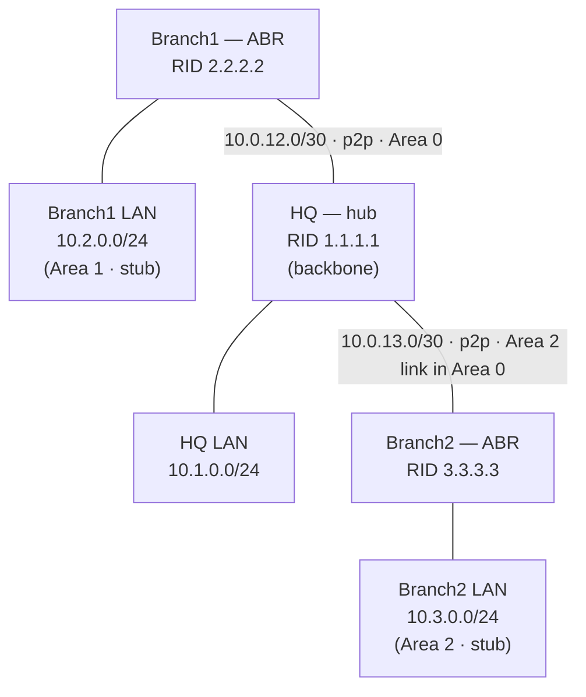

# Lab 01 — Multi-site OSPF + Site-to-Site IPsec VPN

Three sites (HQ + two branches) connected over a simulated WAN in a hub-and-spoke
topology, running **multi-area OSPF** (an area-0 backbone with two **stub areas**) and,
on top of it, a **site-to-site IPsec VPN** between HQ and Branch1.

- **Platform:** GNS3
- **Routers:** VyOS (rolling release) — VyOS runs FRRouting for OSPF and strongSwan for IPsec in one box
- **Status:** OSPF designed, built, and verified ✅ · Site-to-site IPsec VPN built and verified ✅

---

## Objective

- Build a realistic multi-site enterprise WAN: a hub (HQ) and two branch sites.
- Run OSPF with a backbone (area 0) and per-branch **stub areas** so branch routers stay lean.
- Add a site-to-site **IPsec tunnel** so HQ↔Branch traffic is encrypted in transit (compliance use case).
- Verify with adjacencies, route tables, and end-to-end reachability.

## Topology



All WAN links are point-to-point `/30`s in **area 0**. Each branch router is an **ABR**:
area 0 on the WAN side, its own **stub area** on the LAN side.

## IP addressing

| Device | Interface | IP / mask | OSPF area | Role |
|--------|-----------|-----------|-----------|------|
| **HQ** | router-id | `1.1.1.1` | — | hub / backbone |
| | `eth0` → Branch1 | `10.0.12.1/30` | 0 | WAN link (p2p) |
| | `eth1` → Branch2 | `10.0.13.1/30` | 0 | WAN link (p2p) |
| | `dum0` (LAN) | `10.1.0.1/24` | 0 | HQ LAN (passive) |
| **Branch1** | router-id | `2.2.2.2` | — | ABR |
| | `eth0` → HQ | `10.0.12.2/30` | 0 | WAN link (p2p) |
| | `dum0` (LAN) | `10.2.0.1/24` | **1 (stub)** | Branch1 LAN (passive) |
| **Branch2** | router-id | `3.3.3.3` | — | ABR |
| | `eth0` → HQ | `10.0.13.2/30` | 0 | WAN link (p2p) |
| | `dum0` (LAN) | `10.3.0.1/24` | **2 (stub)** | Branch2 LAN (passive) |

> LANs are modeled with VyOS `dummy` interfaces (always up; advertise the full `/24`,
> unlike a true loopback which advertises a `/32`).

**IPsec overlay (HQ ↔ Branch1):** a route-based tunnel rides *on top of* the WAN link.

| Device | Tunnel interface | Tunnel IP | Encrypts |
|--------|------------------|-----------|----------|
| **HQ** | `vti0` | `10.0.99.1/30` | traffic to `10.2.0.0/24` (Branch1 LAN) |
| **Branch1** | `vti0` | `10.0.99.2/30` | traffic to `10.1.0.0/24` (HQ LAN) |

The tunnel is transported between the WAN addresses `10.0.12.1 ↔ 10.0.12.2`; the
`10.0.99.0/30` overlay is the routed inside of the tunnel.

## Design decisions (the *why*)

- **Hub-and-spoke** — mirrors real branch WANs: branches connect to HQ, not to each other. Branch-to-branch traffic transits the hub.
- **Static router-IDs** (`1.1.1.1` / `2.2.2.2` / `3.3.3.3`) — deterministic and stable; they won't shift if an interface flaps.
- **Stub areas at the branches** — a branch is a leaf site. A stub area blocks **Type 5 (external) LSAs**; the ABR injects a single **default route** instead. Result: smaller routing tables, less CPU/RAM, and stability (a flap elsewhere doesn't churn the branch).
- **`passive-interface default`, then opt-in the WAN links** — every interface is passive by default; OSPF is explicitly enabled only on links facing another router. Fail-safe: you can't accidentally form an adjacency on a user-facing LAN. A passive interface still *advertises* its subnet but sends no hellos.
- **Point-to-point network type on `/30` links** — skips the pointless DR/BDR election on two-router links: no 40-second wait, faster convergence, cleaner database.

### IPsec design decisions

- **Route-based (VTI), not policy-based** — the tunnel is bound to a virtual interface (`vti0`); traffic is encrypted because it's *routed into the tunnel*, not because it matched a traffic-selector ACL. This is how enterprise gear (Fortinet, Cisco, Palo Alto) models VPNs, it scales, and it lets a routing protocol run over the tunnel later.
- **IKEv2 + AES-256 + SHA-256 + DH group 14** — modern, audit-friendly crypto. IKEv2 over the legacy v1; DH-14 (2048-bit) is the current minimum (DH-2/1024-bit is deprecated).
- **Perfect Forward Secrecy (PFS)** — forces a fresh Diffie-Hellman exchange for the data keys, so compromising one session's key can't decrypt past or future sessions. A direct PCI-DSS / DoD compliance win.
- **Static route into the tunnel (AD 1) over OSPF (AD 110)** — pulls inter-site LAN traffic into the encrypted path while leaving OSPF as automatic fail-back: if the tunnel drops, traffic reverts to the (cleartext) WAN path — still reachable, and an event you'd alert on.
- **Pre-shared key for the lab; certificates in production** — a PSK is fine to demonstrate the mechanism, but production site-to-site uses X.509 certificates (nothing shared to leak, and it scales to many peers).

## Config

Sanitized VyOS exports for each router live in [`configs/`](configs/).
Key VyOS commands used:

```bash
# Identity + interface
set system host-name HQ
set interfaces ethernet eth0 address 10.0.12.1/30
set interfaces dummy dum0 address 10.1.0.1/24

# OSPF
set protocols ospf parameters router-id 1.1.1.1
set protocols ospf area 0 network 10.0.12.0/30
set protocols ospf passive-interface default              # default passive
set protocols ospf interface eth0 passive disable         # opt the WAN link back in
set protocols ospf interface eth0 network point-to-point  # no DR/BDR on a /30

# Branch ABR — declare the LAN area as a stub
set protocols ospf area 1 area-type stub
```

Route-based IPsec (HQ side; Branch1 mirrors with the directional values reversed):

```bash
# Virtual Tunnel Interface — routing traffic into vti0 encrypts it
set interfaces vti vti0 address 10.0.99.1/30

# Phase 1 (IKE) and Phase 2 (ESP) — params must match on both ends
set vpn ipsec ike-group HQ-IKE key-exchange ikev2
set vpn ipsec ike-group HQ-IKE proposal 1 dh-group 14
set vpn ipsec esp-group HQ-ESP pfs dh-group14                # Perfect Forward Secrecy

set vpn ipsec interface eth0                                 # arm IPsec on the WAN

# Bind the peer to the tunnel interface — this is what makes it "route-based"
set vpn ipsec site-to-site peer BRANCH1 remote-address 10.0.12.2
set vpn ipsec site-to-site peer BRANCH1 vti bind vti0
set vpn ipsec site-to-site peer BRANCH1 vti esp-group HQ-ESP

# Steer the remote LAN into the tunnel (static AD 1 beats OSPF AD 110)
set protocols static route 10.2.0.0/24 next-hop 10.0.99.2
```

## Verification

Full captures are in [`verification/`](verification/). Highlights:

**Adjacency (clean point-to-point — note the `Full/-`, no DR/BDR):**
```
Neighbor ID  Pri State        Up Time   Address     Interface
1.1.1.1        1 Full/-       1m08s     10.0.12.1   eth0:10.0.12.2
```

**Branch1 routing table — learned every site dynamically (no static routes):**
```
O>* 10.1.0.0/24 [110/2] via 10.0.12.1, eth0     # HQ LAN
O   10.2.0.0/24 [110/1] is directly connected, dum0
O>* 10.3.0.0/24 [110/3] via 10.0.12.1, eth0     # Branch2 LAN, 2 areas + hub away
```

**End-to-end proof — Branch1 LAN → Branch2 LAN (crosses area 1 → area 0 → area 2):**
```
ping 10.3.0.1 source-address 10.2.0.1 count 4
4 packets transmitted, 4 received, 0% packet loss
```

### IPsec verification

Full captures in [`verification/ipsec-verification.txt`](verification/ipsec-verification.txt). Highlights:

**Tunnel up — and the byte counters prove traffic actually used it:**
```
Connection    State  Uptime  Bytes In/Out  Packets In/Out  Proposal
BRANCH1-vti   up     8m18s   420B/420B     5/5             AES_CBC_256/HMAC_SHA2_256_128
```
Non-zero, symmetric counters = the 5 test pings rode the encrypted tunnel (not the cleartext OSPF path — that would show `0B/0B`).

**Route-based steering — static tunnel route wins on admin distance:**
```
10.2.0.0/24  via "static", distance 1,   best, Status: Installed   * 10.0.99.2, via vti0
10.2.0.0/24  via "ospf",   distance 110,       Status: None          10.0.12.2, via eth0
```

**Proof of encryption — packet capture on the physical WAN shows only ESP:**
```
monitor traffic interface eth0 filter 'ip proto 50'
IP 10.0.12.2 > 10.0.12.1: ESP(spi=0xc9a6d29c,seq=0x9), length 136
IP 10.0.12.1 > 10.0.12.2: ESP(spi=0xc3b1163a,seq=0x9), length 136
```
Outer IPs are the WAN addresses; the inner ICMP and LAN IPs are invisible. Capturing the same interface with an `icmp` filter during the ping shows **nothing** — the cleartext never appears on the wire.

## Lessons learned

- **Network-type mismatch — "adjacency Full but no routes."** With one end of a `/30`
  set to `broadcast` and the other to `point-to-point`, the OSPF neighbor reached
  **Full**, but **no transit routes installed** through it. Cause: the two ends describe
  the link differently in their LSAs, so SPF's **bidirectional check** fails and refuses
  to compute routes through that neighbor. The tell was **asymmetry** — HQ had one
  branch's LAN but not the other's — which pinpointed the single still-mismatched link.
  Fix: set both ends to `point-to-point`; it converged instantly.
  *Takeaway: Full neighbor + missing routes → suspect a network-type (or MTU) mismatch.*
- **VyOS is transactional** — changes don't apply until `commit`, and don't persist
  across reboot until `save`. Hostname changes silently reverted until explicitly saved.
- **An incomplete IPsec peer = silent empty SA table.** The first build left HQ's peer
  with only `connection-type` set — no `remote-address`, no `ike-group`. `commit` *failed*
  the validation ("Missing ike-group on site-to-site peer"), so nothing loaded, and
  `show vpn ipsec sa` returned an **empty table** — no error, just no tunnel. *Takeaway:
  an empty SA table means the connection never loaded (re-check the peer + that `commit`
  actually succeeded); a `down`/`connecting` row means it loaded but isn't negotiating.*
- **`set vpn ipsec interface <wan-if>` is required** — without arming IPsec on the WAN
  interface, strongSwan builds the config but never activates the connection.
- **Diffing with `+` / `-`** — in config-mode `show`, a `+` prefix marks staged-but-not-
  committed lines and `-` marks pending deletions; handy for confirming what a `commit`
  will actually change.

## Next

- [x] Site-to-site IPsec VPN (HQ ↔ Branch1) over the WAN; verified ESP / encrypted traffic.
- [x] Captured tunnel-up SA, route-based steering, and ESP-on-the-wire proof.
