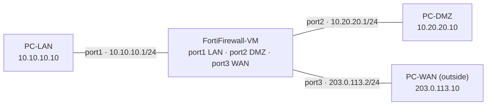

# Lab 02 — FortiGate / FortiFirewall Firewall Policy

A zone-based firewall (LAN / DMZ / WAN) built on **FortiFirewall-VM** in GNS3,
demonstrating interface/zone policy, NAT (SNAT + DNAT/VIP), and a
**deny-by-default** posture. Reinforces Fortinet FCP – Network Security training.

- **Platform:** GNS3 · FortiFirewall-VM64-KVM **v7.4.12** (the firewall-only FortiOS variant — same policy/NAT/VIP engine as FortiGate, without the UTM security-service profiles)
- **Hosts:** VPCS (LAN / DMZ / WAN test clients)
- **Status:** Designed, built, and configured ✅ · **Transit forwarding blocked by an invalid VM evaluation license** — see [Findings](#findings--the-eval-license-blocker). Policy verification completed up to the firewall-forwarding stage; the troubleshooting that isolated the cause is the core artifact of this lab.

---

## Objective

- Stand up a firewall between three trust zones: **LAN** (trusted), **DMZ** (semi-trusted, hosts a published server), **WAN** (untrusted).
- Write zone policy with **deny-by-default**; permit only what's needed.
- Demonstrate both NAT directions: **SNAT** for LAN egress, **DNAT/VIP** to publish a DMZ server.
- Verify allowed vs. blocked traffic, and troubleshoot like a production firewall.

## Topology



## IP addressing

| Zone | FortiGate port | IP / mask | Test host | Mgmt access (`allowaccess`) |
|------|----------------|-----------|-----------|------------------------------|
| **LAN** (trusted) | `port1` | `10.10.10.1/24` | PC-LAN `10.10.10.10` | `ping https ssh` |
| **DMZ** (semi-trusted) | `port2` | `10.20.20.1/24` | PC-DMZ `10.20.20.10` | `ping` |
| **WAN** (untrusted) | `port3` | `203.0.113.2/24` | PC-WAN `203.0.113.10` | `ping` |

> `203.0.113.0/24` is TEST-NET-3 (RFC 5737 documentation space) standing in for the public internet.

## Design decisions (the *why*)

- **Deny-by-default** — the firewall permits only explicitly allowed flows; everything else hits the implicit deny. The opposite of a router, which forwards anything it has a route for.
- **Stateful inspection** — an allowed *outbound* session auto-permits its return traffic; no reverse rules needed.
- **No management on the WAN interface** — `allowaccess` on `port3` (WAN) is `ping` only. HTTPS/SSH management is never exposed to the untrusted side; the trusted LAN gets `https ssh`. A real hardening rule auditors check.
- **DMZ → LAN denied (containment)** — the entire reason a DMZ exists: a compromised internet-facing server must not be able to pivot into the trusted LAN. Modeled as an explicit, logged deny.
- **Two NAT directions:**
  - **SNAT** (`set nat enable` on the LAN→WAN policy) — outbound; many LAN hosts hide behind the WAN interface IP.
  - **DNAT / VIP** — inbound; a public IP:port is mapped to the private DMZ server so the outside world can reach the published service.

## Config

Sanitized FortiOS config in [`configs/fortifirewall.conf`](configs/fortifirewall.conf). Key commands:

```bash
# Interfaces (port1 boots DHCP -> must set mode static first)
config system interface
    edit port1
        set alias "LAN"
        set mode static
        set ip 10.10.10.1 255.255.255.0
        set allowaccess ping https ssh
    next
    edit port3
        set alias "WAN"
        set ip 203.0.113.2 255.255.255.0
        set allowaccess ping            # NO https/ssh on the untrusted side
    next
end

# Zone policy with SNAT for LAN egress
config firewall policy
    edit 0
        set name "LAN-to-WAN"
        set srcintf "port1"
        set dstintf "port3"
        set srcaddr "all"
        set dstaddr "all"
        set action accept
        set schedule "always"
        set service "PING" "HTTP" "HTTPS" "DNS"
        set nat enable                  # SNAT to the WAN interface IP
        set logtraffic all
    next
end
```

## Verification

Captures and the full troubleshooting trace are in
[`verification/troubleshooting.txt`](verification/troubleshooting.txt).

**Deny-by-default proven (before any policy):** PC-LAN → PC-DMZ times out — the
implicit deny dropping inter-zone traffic.

```
PC-LAN> ping 10.20.20.10
10.20.20.10 icmp_seq=1 timeout
```

**Host ↔ firewall reachability confirmed for all three zones** (each PC pings its
own gateway), proving L1/L2/L3 and `allowaccess` are correct.

## Findings — the eval-license blocker

After building correct policies, inter-zone pings still failed. Isolated the
cause with FortiOS's native troubleshooting tools — *the* skill this lab proves:

1. **`diagnose sniffer packet any 'icmp' 4`** → echo requests arrive `port1 in`, but **never** `port2 out`. The firewall accepts and then drops; the DMZ host is exonerated.
2. **`diagnose debug flow`** → `received` → `allocate a new session` → `find a route ... via port2` → **then nothing.** The packet is dropped *after* routing, *before* the policy/forward stage — and silently. Config and routing are correct.
3. **`get system performance status`** → memory 31 % — **not** conserve mode, so it isn't resources.
4. **`get system status`** → **`License Status: Invalid`.** Root cause.

**Conclusion:** an unlicensed FortiGate/FortiFirewall-VM boots, accepts configuration,
and answers pings to its own interfaces, but **refuses to forward transit traffic
between zones** until a valid license is validated with FortiCare (which requires
internet from the VM). The policy design and config in this lab are correct and
complete through the firewall-forwarding stage; full end-to-end allow/deny and the
VIP/DNAT tests require a licensed VM.

## What this lab demonstrates

- FortiOS CLI fluency: the `config / edit / set / next / end` model, `show` vs `get`.
- Zone-based, deny-by-default policy design with SNAT and DNAT/VIP intent.
- Interface hardening (`allowaccess`: no management on the WAN).
- **Production-grade troubleshooting:** packet sniffer → flow trace → system/license
  status to isolate a transit-forwarding failure to its true root cause.

## Next / future work

- [ ] Apply a FortiGate/FortiFirewall-VM evaluation license (Fortinet account) and give the VM internet via a GNS3 NAT cloud to validate it.
- [ ] Complete end-to-end tests: LAN→DMZ / LAN→WAN allow, DMZ→LAN deny, and the WAN→DMZ **VIP/DNAT** publish.
- [ ] Capture policy hit counters and deny logs.
- Alternative path (no licensing): rebuild the same zone-policy/NAT/deny-by-default design on **VyOS zone-based firewall** + iptables.
