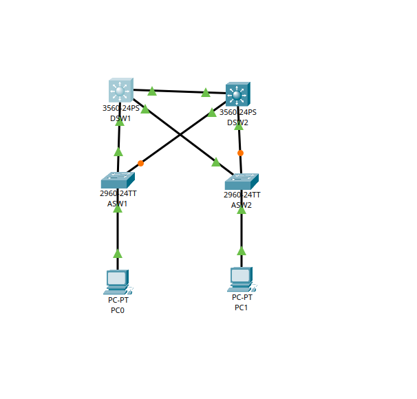
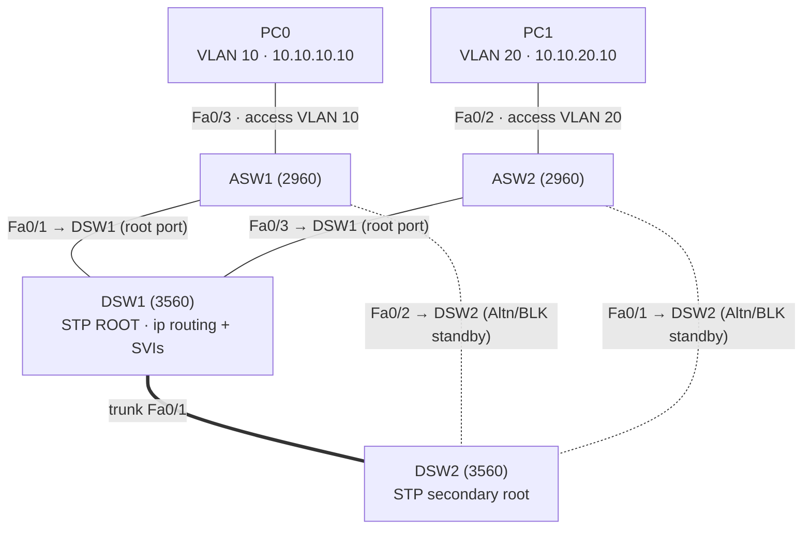
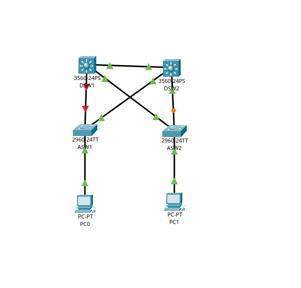

# Lab 03 — Enterprise Campus VLAN / STP

A **collapsed-core** campus switching design built in **Cisco Packet Tracer**:
VLAN segmentation, 802.1Q trunks, **Rapid-PVST+** with deliberate root-bridge
placement, **port security** on the access edge, and **inter-VLAN routing** on the
multilayer core. Reinforces CCNA switching fundamentals.

- **Platform:** Cisco Packet Tracer
- **Devices:** 2× Catalyst **3560** multilayer switches (collapsed core / distribution — `DSW1`, `DSW2`) · 2× Catalyst **2960** access switches (`ASW1`, `ASW2`) · 2 PCs
- **Status:** Designed, built, verified ✅ — VLANs, trunks, Rapid-PVST+ root placement, port security, inter-VLAN routing, and a **zero-loss STP failover** all confirmed.

---

## Objective

- Segment a campus into purpose-built VLANs and carry them on 802.1Q trunks.
- Run **Rapid-PVST+** and **deliberately place the root bridge** on the core (not by MAC lottery).
- Build a **redundant** access layer (each access switch dual-homed to both cores) and prove STP keeps it loop-free yet fault-tolerant.
- Secure the access edge with **PortFast + BPDU Guard** and **port security**.
- Provide **inter-VLAN routing** in hardware on the multilayer core (SVIs + `ip routing`).
- Verify allowed traffic, routed traffic (TTL proof), and sub-second failover.

## Topology

Each access switch has **two uplinks** — one to each core switch. That redundancy
creates a physical loop on purpose; STP's job is to make it a **loop-free logical
topology** (redundant physical, loop-free logical).



> Amber link lights = STP-blocked standby uplinks; green = forwarding.



Solid lines = forwarding; dotted lines = STP-blocked standby uplinks.

## VLAN & IP plan

| VLAN | Name | Subnet | Gateway (SVI on DSW1) | Notes |
|------|------|--------|------------------------|-------|
| 10 | STAFF | 10.10.10.0/24 | 10.10.10.1 | PC0 lives here (ASW1 Fa0/3) |
| 20 | SALES | 10.10.20.0/24 | 10.10.20.1 | PC1 lives here (ASW2 Fa0/2) |
| 30 | SERVERS | 10.10.30.0/24 | 10.10.30.1 | gateway provisioned |
| 99 | MGMT | 10.10.99.0/24 | 10.10.99.1 | dedicated management VLAN |
| 999 | NATIVE | — | — | unused **native VLAN** on trunks |

### Cabling map (from `show cdp neighbors`)

| Link | End A | End B |
|------|-------|-------|
| Core | DSW1 Fa0/1 | DSW2 Fa0/1 |
| Access | DSW1 Fa0/2 | ASW1 Fa0/1 |
| Access | DSW1 Fa0/3 | ASW2 Fa0/3 |
| Access | DSW2 Fa0/2 | ASW1 Fa0/2 |
| Access | DSW2 Fa0/3 | ASW2 Fa0/1 |

## Design decisions (the *why*)

- **VLAN segmentation** — separate broadcast domains for security and broadcast control; cross-VLAN traffic must be *routed*, giving a chokepoint to filter later.
- **Dedicated management VLAN (99)** — switches are never managed over VLAN 1; a separate mgmt VLAN is the hardening baseline.
- **Native VLAN = 999 (unused)** — the default native VLAN 1 is a known **VLAN-hopping (double-tagging)** vector. Moving the native VLAN to an unused ID closes it.
- **Allowed-VLAN pruning** — trunks carry only `10,20,30,99,999`; VLAN 1 is pruned off the trunks entirely. Less flooding, smaller attack surface.
- **Deliberate root placement** — STP *always* elects a root, but by default it picks **lowest MAC = essentially random**, which could hand the role to an access switch in a closet. `root primary`/`secondary` pins it to the core for optimal paths and prevents a new switch from hijacking the topology.
- **Rapid-PVST+** — sub-second reconvergence via pre-computed alternate ports, vs. ~30 s of listen/learn in classic STP. The mode must be **consistent network-wide**.
- **PortFast + BPDU Guard on access ports** — PortFast skips listen/learn so a PC links up immediately (safe only on edge ports); BPDU Guard err-disables the port if a switch is ever plugged in, stopping a rogue switch from hijacking STP.
- **Port security (sticky, max 1, violation shutdown)** — binds each access port to its one legitimate MAC; defends against rogue devices and CAM-table (MAC-flooding) attacks.
- **Multilayer inter-VLAN routing** — routing between SVIs in hardware on the 3560 (`ip routing`), instead of slow router-on-a-stick.

## Config (key commands)

Full sanitized configs per device in [`configs/`](configs/).

```bash
# --- All four switches: consistent STP mode ---
spanning-tree mode rapid-pvst

# --- DSW1 / DSW2: deliberate root placement (all VLANs) ---
# DSW1
spanning-tree vlan 1,10,20,30,99,999 root primary     # priority 24576
# DSW2
spanning-tree vlan 1,10,20,30,99,999 root secondary   # priority 28672

# --- Trunks (3560 needs encapsulation; 2960 is dot1q-only) ---
interface range fa0/1 - 3
 switchport trunk encapsulation dot1q   # 3560 only — omit on 2960
 switchport mode trunk
 switchport trunk native vlan 999
 switchport trunk allowed vlan 10,20,30,99,999

# --- Access port: VLAN + edge hardening + port security (ASW1 Fa0/3) ---
interface fa0/3
 switchport mode access
 switchport access vlan 10
 spanning-tree portfast
 spanning-tree bpduguard enable
 switchport port-security
 switchport port-security maximum 1
 switchport port-security mac-address sticky
 switchport port-security violation shutdown

# --- DSW1: inter-VLAN routing ---
ip routing
interface vlan 10
 ip address 10.10.10.1 255.255.255.0
interface vlan 20
 ip address 10.10.20.1 255.255.255.0
# (vlan 30, 99 likewise)
```

## Verification

Full captures in [`verification/verification.txt`](verification/verification.txt).

**Deterministic STP root** — DSW1 is root for VLAN 10 with all ports Designated; ASW1 reaches the root via its **direct** link (cost 19) and parks the DSW2 uplink as Alternate/blocking:

```
ASW1# show spanning-tree vlan 10
  Root ID  Priority 24586  Address 0060.7086.2435  Cost 19  Port 1 (Fa0/1)
  Fa0/1    Root  FWD  19        (direct to DSW1 — the short path)
  Fa0/2    Altn  BLK  19        (DSW2 uplink — hot standby)
```

**Inter-VLAN routing proven** — PC0 (VLAN 10) → PC1 (VLAN 20). The reply returns at
**TTL 127** (Windows starts at 128), proving the packet crossed exactly **one routed hop** (DSW1):

```
C:\> ping 10.10.20.10
Reply from 10.10.20.10: bytes=32 time<1ms TTL=127      # routed (128 → 127)
```

(Pinging the SVIs directly returns TTL 255 — not decremented — confirming those are the switch's own L3 interfaces.)

**Zero-loss STP failover** — with a continuous ping running, DSW1's link to ASW1 was
shut down. RSTP promoted the pre-computed Alternate port instantly:



> During the test the DSW1↔ASW1 link is down (red); ASW1 fails over to its DSW2 uplink with no dropped packets.

```
Ping statistics for 10.10.20.10:
    Packets: Sent = 91, Received = 91, Lost = 0 (0% loss)
```

Classic STP would have blackholed this traffic for ~30 s; Rapid-PVST+ did it with **0 dropped packets**.

**Port security active** — sticky MAC learned and bound to the access port:

```
ASW1# show port-security address
  Vlan 10   000A.F398.5532   SecureSticky   Fa0/3
```

## Troubleshooting log (the core artifact)

Placing the root and converging the fabric surfaced a four-layer problem, each diagnosed and fixed:

1. **Random root (MAC lottery)** — default equal priorities meant lowest MAC won. → set priority so the core wins.
2. **Per-VLAN re-lottery** — PVST+ runs one tree *per VLAN*; new VLANs reverted to default priority. → `root primary/secondary` for **all** VLANs.
3. **STP mode mismatch** — access switches still ran classic `ieee` while the core ran `rstp`, producing inverted port roles (the "root" showed blocking ports; an access switch out-designated the root and took the cost-38 long path). → standardized on `rapid-pvst` network-wide.
4. **Stuck point-to-point link** — a failed RSTP proposal/agreement left a link wedged. → flapped the link (`shut`/`no shut`) to force clean renegotiation.

**Method that cracked it:** when a switch's self-report is contradictory, **ask its neighbor** — DSW1 swore it was root yet showed `Altn/BLK` ports; one `show spanning-tree` on ASW1 instantly revealed `protocol ieee`.

## What this lab demonstrates

- VLAN design, 802.1Q trunking, native-VLAN and allowed-VLAN hardening.
- Rapid-PVST+ operation and **deterministic root-bridge engineering**.
- Layer-2 edge security: PortFast, BPDU Guard, port security (sticky MAC).
- Multilayer **inter-VLAN routing** (SVIs + `ip routing`) and how to *prove* it (TTL).
- Designing for redundancy and validating **failover with zero packet loss**.
- Structured STP troubleshooting from the neighbor's perspective.

## Next / future work

- [ ] **First-hop redundancy (HSRP/VRRP)** on the SVIs so gateway survives DSW1 loss, not just L2.
- [ ] **Per-VLAN root load-balancing** — DSW1 root for odd VLANs, DSW2 for even, so both uplinks carry traffic.
- [ ] **DHCP** per VLAN (ip helper-address / pools) instead of static PC addressing.
- [ ] **Root Guard / Loop Guard** on distribution links; **DHCP snooping + DAI** for a fuller L2 security story.
